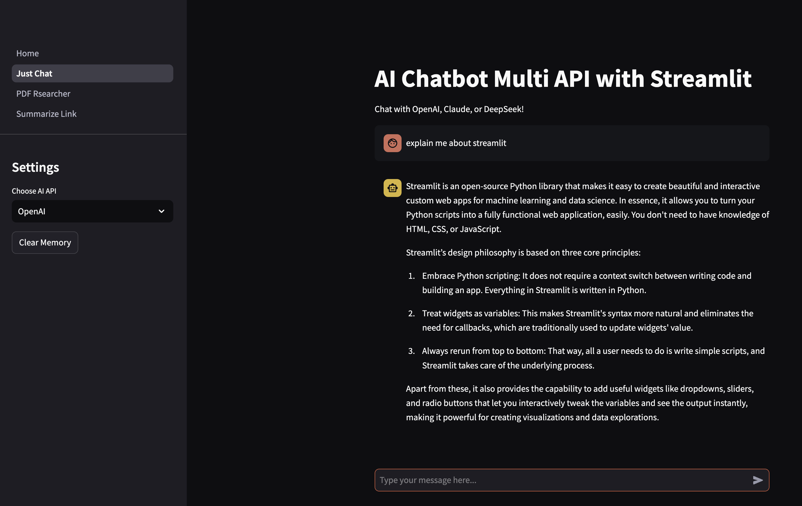
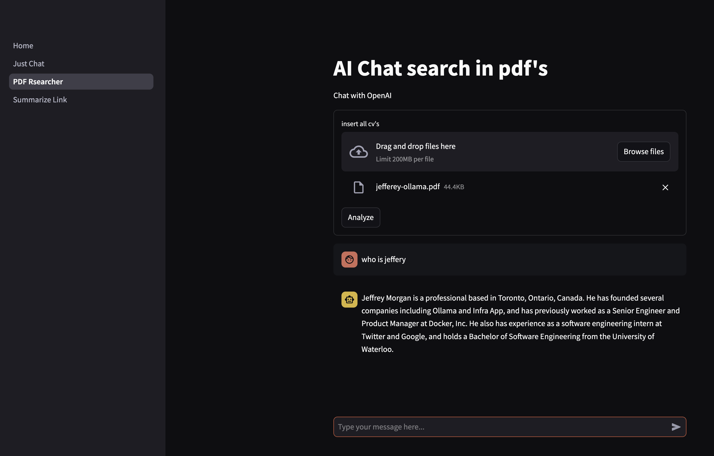
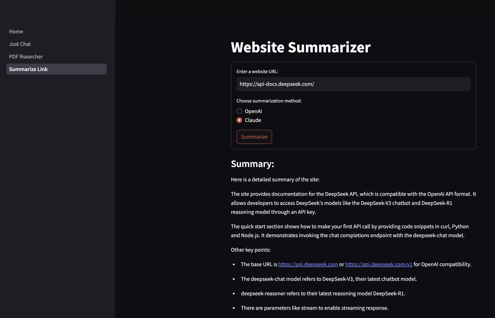

# GADAGENI

A Streamlit app that showcases AI interaction using APIs with OpenAI and Anthropic.

## Features

- **Just Chat**: Engage in natural conversations with AI models from OpenAI (e.g., GPT-4) or Anthropic's Claude.
- **PDF Interaction**: Upload PDFs and leverage Retrieval-Augmented Generation (RAG) to extract insights, summarize, or answer questions based on document content.
- **Link Summarizer**: Provide a URL, and the app will generate an AI-powered summary of the webpage's key points.

## Installation

### Prerequisites

Ensure you have the following installed:

- Python 3.8+
- Pip (Python package manager)
- A valid API key for OpenAI and/or Anthropic

### Steps

1. **Clone the repository**:

   ```bash
   git clone https://github.com/your-username/gadageni.git
   cd gadageni
   ```

2. **Create a virtual environment (optional but recommended)**:

   ```bash
   python -m venv venv
   source venv/bin/activate  # On Windows use: venv\Scripts\activate
   ```

3. **Install dependencies**:

   ```bash
   pip install -r requirements.txt
   ```

4. **Set up environment variables**:

   Create a `.env` file in the project directory and add your API keys:

   ```env
   OPENAI_API_KEY=your_openai_api_key
   ANTHROPIC_API_KEY=your_anthropic_api_key
   ```

5. **Run the application**:

   ```bash
   streamlit run Home.py
   ```

## Screenshots

Here are some screenshots of the GADAGENI application in action:


*Figure 1: Just Chat feature demonstrating AI conversation*


*Figure 2: PDF Interaction feature for document analysis and querying*


*Figure 3: Link Summarizer feature providing webpage summaries*

These screenshots showcase the main features of the application, including the Just Chat, PDF Interaction, and Link Summarizer functionalities.

## Usage

- Open the Streamlit UI in your browser.
- Select a feature (Just Chat, PDF Interaction, or Link Summarizer).
- Provide inputs as required (text, PDFs, or URLs) and get AI-generated responses.

## Purpose

All in 1 app that able to interact with AI just using API key

### **next feature may will be**

- OCR an images put and image and what is the text in it
- image generation (should be API with multi modal)
- blog post researcher and generator to hugo blog (personal)

